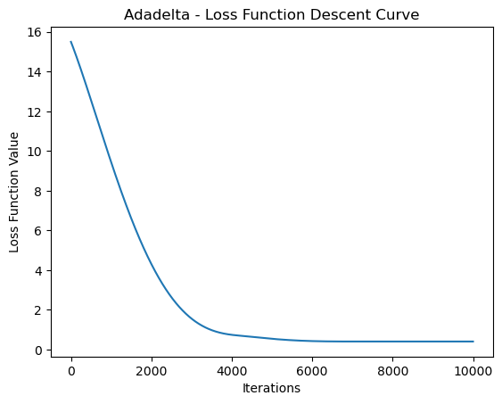

# Adadelta

Adadelta 是一種自適應學習率的優化算法，是 Adagrad 的變種之一。它旨在解決 Adagrad 算法中隨著訓練過程的進行，學習率遞減過快的問題。Adadelta 的主要特點是根據過去的梯度信息動態地調整學習率。

以下是 Adadelta 的詳細介紹：

1. **算法描述**：

   給定損失函數 \(F(\theta)\)，對於每一個參數 \(\theta_i\)，Adadelta 的更新規則為：

   [
   \theta_i = \theta_i - \frac{\sqrt{\tilde{E}[\Delta \theta^2] + \epsilon}}{\sqrt{\tilde{E}[g^2] + \epsilon}} \cdot g_i
   \]

   其中：
   - \(g_i\) 是當前參數 \(\theta_i\) 的梯度。
   - \(\tilde{E}[g^2]\) 是梯度平方的指數移動平均，表示過去梯度平方的加權和。
   - \(\tilde{E}[\Delta \theta^2]\) 是參數變化量平方的指數移動平均，表示過去參數變化量平方的加權和。
   - \(\epsilon\) 是一個很小的常數，用來防止分母為零。

2. **特點**：

   - **自適應學習率**：Adadelta 通過考慮過去梯度平方的移動平均，實現對每個參數的自適應學習率。

   - **無需手動調整學習率**：類似於 Adagrad，Adadelta 的自適應性使得在許多情況下無需手動調整學習率。

   - **避免學習率遞減過快**：由於引入了梯度平方的指數移動平均，Adadelta 在學習過程中能夠避免學習率下降過快的問題，增強了穩定性。

3. **偏差校正**：

   Adadelta 引入了偏差校正的概念，這是為了補償過去梯度平方的指數移動平均未考慮初始時刻的不足。具體而言，Adadelta 對梯度平方的指數移動平均和參數變化量平方的指數移動平均進行了偏差校正：

   \[
   \tilde{E}[g^2] = \rho \cdot \tilde{E}[g^2] + (1 - \rho) \cdot g^2
   \]

   \[
   \tilde{E}[\Delta \theta^2] = \rho \cdot \tilde{E}[\Delta \theta^2] + (1 - \rho) \cdot \Delta \theta^2
   \]

   其中 \(\rho\) 是一個控制偏差校正程度的超參數，通常接近於 1。

Adadelta 的更新規則使用了梯度和過去梯度平方的指數移動平均，並引入了偏差校正的機制。這樣的設計使得 Adadelta 能夠在訓練過程中更好地適應不同參數的學習率，提高了收斂的穩定性。


```python
import numpy as np
import matplotlib.pyplot as plt

# 生成一些虛擬的數據
np.random.seed(42)
X = 2 * np.random.rand(100, 1)
y = 4 + 3 * X + np.random.randn(100, 1)

# 添加偏置項
X_b = np.c_[np.ones((100, 1)), X]

# 初始化模型參數
theta = np.random.randn(2, 1)

# 定義 Adadelta 函數
def adadelta(X, y, theta, rho=0.95, epsilon=1e-8, n_iterations=10000):
    m = len(y)
    E_g_squared = np.zeros_like(theta)
    E_delta_theta_squared = np.zeros_like(theta)
    cost_history = []

    for iteration in range(n_iterations):
        gradients = 2/m * X.T.dot(X.dot(theta) - y)
        E_g_squared = rho * E_g_squared + (1 - rho) * gradients**2
        delta_theta = - np.sqrt(E_delta_theta_squared + epsilon) / np.sqrt(E_g_squared + epsilon) * gradients
        theta = theta + delta_theta
        E_delta_theta_squared = rho * E_delta_theta_squared + (1 - rho) * delta_theta**2

        # 計算當前參數下的損失函數值
        cost = np.sum((X.dot(theta) - y) ** 2) / (2 * m)
        cost_history.append(cost)

    return theta, cost_history

# 使用 Adadelta 優化算法進行模型訓練
theta_adadelta, cost_history_adadelta = adadelta(X_b, y, theta)

# 繪製損失函數下降曲線
plt.plot(cost_history_adadelta)
plt.xlabel('Iterations')
plt.ylabel('Loss Function Value')
plt.title('Adadelta - Loss Function Descent Curve')
plt.show()

# Final model parameters
print('Final model parameters (theta) - Adadelta:', theta_adadelta)


```


    

    


    Final model parameters (theta) - Adadelta: [[4.2138153 ]
     [2.76542933]]
    


```python

```
