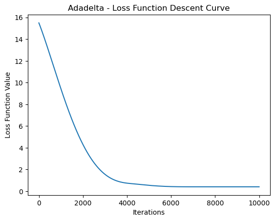

# Adagrad（自適應梯度算法）


Adagrad（自適應梯度算法）是一種優化算法，它利用自適應學習率解決梯度下降中學習率調整的挑戰。Adagrad 的核心思想是根據每個參數的歷史梯度信息，對每個參數使用不同的學習率，這使得對於出現頻率較低的參數，學習率較大；對於出現頻率較高的參數，學習率較小。

以下是 Adagrad 的詳細介紹：

1. **算法描述**：

   給定損失函數 $F(\theta)$，對於每一個參數 $\theta_i$，Adagrad 的更新規則為：

$$
\theta_i = \theta_i - \frac{\alpha}{\sqrt{G_{ii} + \delta}} \cdot \nabla_{\theta_i} F(\theta)
$$

   其中：
   - $\alpha$ 是學習率（通常是一個較小的正數）。
   - $G_{ii}$ 是對應參數 $\theta_i$ 的梯度的平方和的累積，即 $G_{ii} = G_{ii} + (\nabla_{\theta_i} F(\theta))^2$。
   - $\delta$ 是一個很小的常數，防止除以零。

2. **特點**：

   - **自適應學習率**：Adagrad 通過適應每個參數的學習率，使得對於不同參數的更新能夠更具鑑別度。
   
   - **歷史梯度信息**：由於使用了梯度的平方和的累積，Adagrad 考慮了每個參數在整個優化過程中的梯度變化情況，因此能夠對出現頻率低的參數給予較大的學習率。

   - **無需手動調整學習率**：相對於一些需要手動調整學習率的方法，Adagrad 的自適應性使得在許多情況下無需手動調整學習率，能夠更容易地應對不同的問題。

3. **缺點**：

   - **遞減的學習率**：由於學習率是根據歷史梯度的平方和調整的，因此隨著時間的推移，分母上的 $G_{ii}$ 會不斷增加，導致學習率遞減。在訓練後期，學習率可能變得非常小，甚至趨近於零，這可能會導致模型收斂速度減緩。

   - **非凸問題的表現不佳**：Adagrad 在處理非凸問題時可能會表現不佳，因為學習率的遞減可能會使得算法陷入局部極小值。

Adagrad 的特點是對每個參數都有自適應的學習率，並且會根據過去梯度的大小來調整學習率。這種特性對於處理稀疏數據的機器學習任務非常有用，但也可能存在一些問題，例如學習率可能在訓練後期過於縮小。


```python
import numpy as np
import matplotlib.pyplot as plt

# 生成虛構的線性回歸數據
np.random.seed(42)
X = 2 * np.random.rand(100, 1)
y = 4 + 3 * X + np.random.randn(100, 1)

# 添加偏差項 x0=1 到每個實例
X_b = np.c_[np.ones((100, 1)), X]

def compute_cost(X, y, theta):
    m = len(y)
    cost = np.sum((X.dot(theta) - y) ** 2) / (2 * m)
    return cost

def adagrad(X, y, theta, learning_rate, n_iterations, delta=1e-7):
    m = len(y)
    G = np.zeros_like(theta)
    cost_history = []

    for iteration in range(n_iterations):
        gradients = 2/m * X.T.dot(X.dot(theta) - y)
        G += gradients**2
        theta = theta - (learning_rate / np.sqrt(G + delta)) * gradients

        # 計算當前參數下的損失函數值
        cost = compute_cost(X, y, theta)
        cost_history.append(cost)

    return theta, cost_history


# 初始化模型參數
theta_initial = np.random.randn(2, 1)

# 設定學習率和迭代次數
learning_rate = 0.1
n_iterations = 1000

# 使用 Adagrad 優化模型參數
theta_adagrad, cost_history_adagrad = adagrad(X_b, y, theta_initial, learning_rate, n_iterations)

# Plot the loss function convergence curve
plt.plot(cost_history_adagrad)
plt.xlabel('Number of Iterations')
plt.ylabel('Loss Function Value')
plt.title('Adagrad - Loss Function Convergence')
plt.show()

# Final model parameters
print('Final Model Parameters (theta) - Adagrad:', theta_adagrad)

```


    

    


    Final Model Parameters (theta) - Adagrad: [[3.08910875]
     [3.73626968]]
    


```python

```
