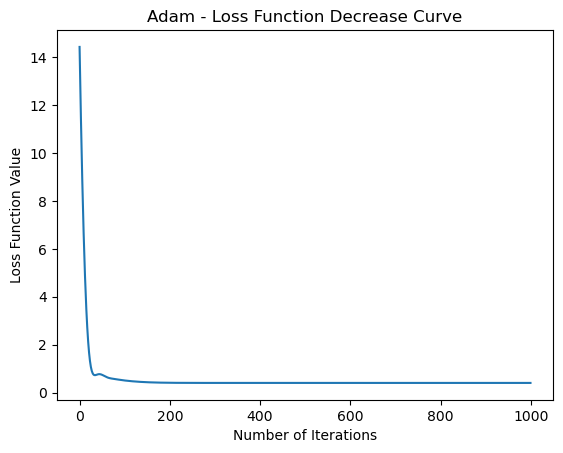

**Adam（Adaptive Moment Estimation）**

Adam 是一種自適應學習率的優化算法，結合了動量梯度下降和RMSprop的優點。它使用一階動量（平均梯度）和二階動量（梯度平方的指數移動平均）來調整每個參數的學習率。Adam的主要特點包括：

1. **算法描述**：

   給定損失函數 $F(\theta)$，對於每一個參數 $\theta_i$，Adam 的更新規則為：


$
\m_t = \beta_1 \cdot m_{t-1} + (1 - \beta_1) \cdot \nabla_{\theta_i} F(\theta_t) 

\v_t = \beta_2 \cdot v_{t-1} + (1 - \beta_2) \cdot (\nabla_{\theta_i} F(\theta_t))^2 

\hat{m}_t = \frac{m_t}{1 - \beta_1^t} 

\hat{v}_t = \frac{v_t}{1 - \beta_2^t} 

\theta_{t+1} = \theta_t - \frac{\alpha}{\sqrt{\hat{v}_t} + \delta} \cdot \hat{m}_t
$


   其中：
   - $\alpha$ 是學習率。
   - $\beta_1$ 和 $\beta_2$ 是動量梯度下降和RMSprop中的指數衰減因子，通常取0.9和0.999。
   - $m_t$ 是一階動量，表示梯度的指數移動平均。
   - $v_t$ 是二階動量，表示梯度平方的指數移動平均。
   - $\hat{m}_t$ 和 $\hat{v}_t$ 是對應一階和二階動量的偏差校正。
   - $\delta$ 是一個很小的常數，避免分母為零。

2. **特點**：

   - **自適應學習率**：Adam 使用動量的概念來調整每個參數的學習率，這有助於在訓練過程中適應不同參數的梯度變化情況。

   - **偏差校正**：引入了偏差校正項 $\hat{m}_t$ 和 $\hat{v}_t$，有助於在訓練初期糾正動量和二階動量的偏差。

   - **無需手動調整參數**：通常情況下，Adam的預設超參數表現良好，不需要手動調整。

3. **缺點**：

   - **複雜度**：相對於其他優化算法，Adam的計算量相對較大。

   - **對超參數敏感**：雖然Adam的默認超參數通常表現良好，但對於某些任務，可能需要進行調參。


```python
import numpy as np
import matplotlib.pyplot as plt

# 生成虛擬數據
np.random.seed(42)
X = 2 * np.random.rand(100, 1)
y = 4 + 3 * X + np.random.randn(100, 1)

# 添加偏差項
X_b = np.c_[np.ones((100, 1)), X]

# 初始化模型參數
theta = np.random.randn(2, 1)

# 定義 Adam 優化算法
def adam(X, y, theta, learning_rate, n_iterations, beta1=0.9, beta2=0.999, epsilon=1e-8):
    m = len(y)
    m_t = np.zeros_like(theta)
    v_t = np.zeros_like(theta)
    t = 0
    cost_history = []

    for iteration in range(n_iterations):
        t += 1
        gradients = 2/m * X.T.dot(X.dot(theta) - y)
        m_t = beta1 * m_t + (1 - beta1) * gradients
        v_t = beta2 * v_t + (1 - beta2) * gradients**2

        m_t_hat = m_t / (1 - beta1**t)
        v_t_hat = v_t / (1 - beta2**t)

        theta = theta - (learning_rate / (np.sqrt(v_t_hat) + epsilon)) * m_t_hat

        # 計算當前參數下的損失函數值
        cost = np.sum((X.dot(theta) - y) ** 2) / (2 * m)
        cost_history.append(cost)

    return theta, cost_history

# 使用 Adam 優化算法進行模型訓練
theta_adam, cost_history_adam = adam(X_b, y, theta, learning_rate=0.1, n_iterations=1000)

# 繪製損失函數下降曲線
plt.plot(cost_history_adam)
plt.xlabel('Number of Iterations')
plt.ylabel('Loss Function Value')
plt.title('Adam - Loss Function Decrease Curve')
plt.show()

# Final model parameters
print('Final model parameters (theta) - Adam:', theta_adam)


```


    

    


    Final model parameters (theta) - Adam: [[4.21509616]
     [2.77011339]]
    


```python

```
