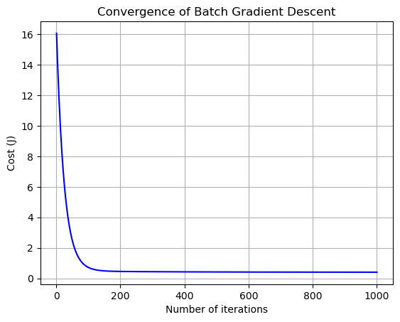

## Batch Gradient Descent 推演

假設我們有一個函數 $F(θ)$，其中 $θ$ 是我們要找到的最小化 $F(θ)$ 的參數向量。

函數 $F(θ)$ 的梯度可以表示為：

$$
∇F(θ) = \frac{1}{m} \sum_{i=1}^{m} (h_θ(x^{(i)}) - y^{(i)}) \cdot x^{(i)}
$$

其中

- $m$ 是訓練樣本數量。
- $h_θ(x^{(i)})$ 是根據參數 $θ$ 和輸入 $x^{(i)}$ 計算得到的預測值。
- $y^{(i)}$ 是實際的標籤值。
- $x^{(i)}$ 是特徵向量。

梯度下降的更新規則如下：

$$
θ := θ - α ∇F(θ)
$$

其中：
- $α$ 是學習速率（learning rate），用於控制每次迭代的步長。

這樣，通過不斷地計算梯度並更新參數 $θ$，我們可以逐步找到使得 $F(θ)$ 最小化的 $θ$ 值。


```python
import numpy as np
import matplotlib.pyplot as plt

# 生成虛擬數據
np.random.seed(42)
X = 2 * np.random.rand(100, 1)
y = 4 + 3 * X + np.random.randn(100, 1)

# 添加偏置項 x0 = 1
X_b = np.c_[np.ones((100, 1)), X]

# 初始化參數
theta = np.random.rand(2, 1)

# 定義損失函數
def compute_cost(X, y, theta):
    m = len(y)
    predictions = X.dot(theta)
    cost = (1 / (2 * m)) * np.sum((predictions - y) ** 2)
    return cost

# 定義梯度下降函數
def gradient_descent(X, y, theta, learning_rate, n_iterations):
    m = len(y)
    cost_history = np.zeros(n_iterations)

    for iteration in range(n_iterations):
        predictions = X.dot(theta)
        errors = predictions - y
        gradient = (1 / m) * X.T.dot(errors)
        theta = theta - learning_rate * gradient
        cost_history[iteration] = compute_cost(X, y, theta)

    return theta, cost_history

# 設置學習率和迭代次數
learning_rate = 0.01
n_iterations = 1000

# 執行梯度下降
theta, cost_history = gradient_descent(X_b, y, theta, learning_rate, n_iterations)

# 打印最終學習的參數
print("Theta:", theta)

# 繪製損失函數的收斂圖
plt.plot(range(1, n_iterations + 1), cost_history, color='blue')
plt.rcParams["figure.figsize"] = (10, 6)
plt.grid()
plt.xlabel('Number of iterations')
plt.ylabel('Cost (J)')
plt.title('Convergence of Batch Gradient Descent')
plt.show()

```

    Theta: [[4.06929893]
     [2.89884441]]
    


    

    


```python

```
