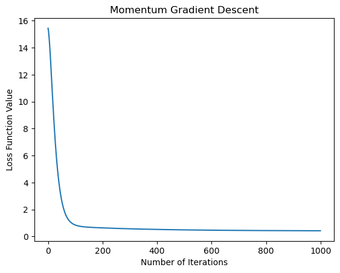

# 動量梯度下降（Momentum）

## 1. 概念：

動量梯度下降是一種用於優化損失函數的梯度下降算法，它引入了一種「動量」的概念，旨在加速收斂速度並提高穩定性。這種方法模擬了物理學中的動量，使得在更新過程中不僅考慮當前的梯度信息，還考慮了之前的更新方向和速度。

## 2. 算法：

給定當前時刻的梯度 \( \nabla F(\theta_t) \)，動量梯度下降的更新規則為：

\[
v_t = \beta \cdot v_{t-1} + (1 - \beta) \cdot \nabla F(\theta_t)
\]

\[
\theta_{t+1} = \theta_t - \alpha \cdot v_t
\]

其中：
- \( \theta_t \) 是當前的模型參數。
- \( \alpha \) 是學習率。
- \( \beta \) 是動量係數，控制了之前梯度的影響程度。
- \( v_t \) 是動量，表示當前的速度。

動量 \( v_t \) 的更新是過去動量 \( v_{t-1} \) 的一個加權和，同時考慮了當前的梯度信息。這使得在更新過程中，如果當前的梯度方向和之前的梯度方向一致，動量會增強，加速更新；如果方向相反，動量會減緩，有助於穩定更新方向。

## 3. 優點：

- **加速收斂：** 動量的引入使得算法在更新時考慮了之前的動量信息，有助於加速收斂速度，特別是在存在大片平坦區域或局部極小值的情況下。

- **提高穩定性：** 動量的使用可以減緩震盪，使得更新方向更加穩定，減少了在一定方向上的頻繁變動。

## 4. 缺點：

- **參數調整：** 需要調整動量係數 \( \beta \)，過大或過小的值都可能影響收斂效果。通常 \( \beta \) 取 0.9 是一個常見的起點。

- **過擬合：** 在某些情況下，由於動量的影響，可能使得算法在峽谷中跳出，進而導致過度擬合。

總體而言，動量梯度下降在實際應用中通常能夠提供更快的收斂速度和更好的穩定性，特別是在高維度、非凸、峽谷和平坦區域的情況下。

### 數學推演

動量梯度下降的數學推演是基於梯度下降算法，我們以簡單的線性回歸損失函數作為例子進行推演。損失函數表示為平方損失：

\[
F(\theta) = \frac{1}{2m} \sum_{i=1}^{m} (\hat{y}^{(i)} - y^{(i)})^2
\]

其中 \(\hat{y}^{(i)}\) 是模型的預測值，\(y^{(i)}\) 是實際標籤值，\(m\) 是樣本數。

推演的過程如下：

1. **隨機抽樣：** 每次迭代從訓練集中隨機抽樣一個樣本，記為 \((x^{(i)}, y^{(i)})\)。

2. **計算梯度：** 計算當前樣本的梯度，即損失函數對模型參數 \(\theta\) 的偏導數。

\[
\nabla F(\theta) = \frac{1}{m} (\hat{y} - y) \cdot x
\]

3. **動量更新：** 引入動量 \(v_t\)，更新動量的規則如下：

\[
v_t = \beta \cdot v_{t-1} + (1 - \beta) \cdot \nabla F(\theta_t)
\]

4. **更新參數：** 使用動量進行參數更新：

\[
\theta_{t+1} = \theta_t - \alpha \cdot v_t
\]

其中：
- \(\theta_t\) 是當前的模型參數。
- \(\alpha\) 是學習率。
- \(\beta\) 是動量係數。
- \(v_t\) 是動量。

這樣的更新過程使得模型的參數在每次迭代中都根據動量進行微調，具有一定的隨機性，有助於跳出局部極小值。動量係數 \(\beta\) 控制了過去動量的影響程度，通常取 0.9 是一個常見的值。

需要注意的是，這只是一個簡單的線性回歸的例子，實際應用中可能會使用更複雜的模型和損失函數。


```python
import numpy as np
import matplotlib.pyplot as plt

# 生成虛擬數據
np.random.seed(42)
X = 2 * np.random.rand(100, 1)
y = 4 + 3 * X + np.random.randn(100, 1)

# 添加偏置項 x0 = 1
X_b = np.c_[np.ones((100, 1)), X]

# 初始化模型參數
theta = np.random.randn(2, 1)

# 設定學習率和動量係數
learning_rate = 0.01
beta = 0.9

# 初始化動量
momentum = np.zeros_like(theta)

# 定義損失函數
def compute_cost(X, y, theta):
    m = len(y)
    predictions = X.dot(theta)
    cost = (1 / (2 * m)) * np.sum((predictions - y) ** 2)
    return cost

# 動量梯度下降迭代
num_iterations = 1000
cost_history = []

for iteration in range(num_iterations):
    # 計算梯度
    gradients = (1 / len(y)) * X_b.T.dot(X_b.dot(theta) - y)
    
    # 更新動量
    momentum = beta * momentum + (1 - beta) * gradients
    
    # 更新參數
    theta = theta - learning_rate * momentum
    
    # 計算當前參數下的損失函數值
    cost = compute_cost(X_b, y, theta)
    cost_history.append(cost)

# 繪製損失函數下降曲線
plt.plot(cost_history)
plt.xlabel('Number of Iterations')
plt.ylabel('Loss Function Value')
plt.title('Momentum Gradient Descent')
plt.show()

# 最終的模型參數
print('Final model parameters (theta):', theta)


```


    

    


    Final model parameters (theta): [[3.9060019 ]
     [3.04302682]]
    


```python

```
