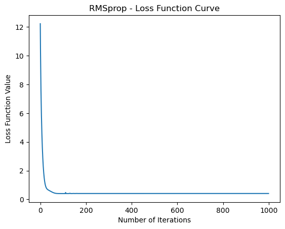

# RMSprop 算法

我們可以將數學符號的表示方式整理如下：

1. **算法描述**：

   給定損失函數 $F(\theta)$，對於每一個參數 $\theta_i$，RMSprop 的更新規則為：

$$
\theta_i = \theta_i - \frac{\alpha}{\sqrt{E[G^2]_t + \delta}} \cdot G_t
$$


   其中：
   - $\alpha$ 是學習率（通常是一個較小的正數）。
   - $G_t$ 是當前梯度 $\nabla_{\theta_i} F(\theta)$。
   - $E[G^2]_t$ 是梯度平方的移動平均，計算方式為 $E[G^2]_t = \beta \cdot E[G^2]<sub>t-1 + (1-\beta) \cdot G_t^2$ ，其中 $\beta$ 是衰減因子，通常取 0.9。
   - $\delta$ 是一個很小的常數，防止除以零。

2. **特點**：

   - **自適應學習率**：RMSprop 通過計算梯度平方的移動平均，使得學習率自適應地調整。這使得對於出現頻率較低的參數，學習率較大；對於出現頻率較高的參數，學習率較小。

   - **避免學習率過大**：RMSprop 的主要改進之一是避免 Adagrad 中梯度平方和的遞增問題。它引入了移動平均，降低了學習率的遞增速度，有助於避免學習率過大的問題。

   - **無需手動調整學習率**：與一些需要手動調整學習率的方法相比，RMSprop 的自適應性使得在許多情況下無需手動調整學習率，能夠更容易地應對不同的問題。

3. **缺點**：

   - **不同參數的更新速度不同**：雖然 RMSprop 通過計算梯度平方的移動平均調整了學習率，但它仍然無法解決所有情況下不同參數的更新速度不同的問題。


```python
import numpy as np
import matplotlib.pyplot as plt

def rmsprop(X, y, theta, learning_rate, n_iterations, beta=0.9, delta=1e-8):
    m = len(y)
    E_squared_gradients = np.zeros_like(theta)
    cost_history = []

    def loss_function(X, y, theta):
        m = len(y)
        return np.sum((X.dot(theta) - y) ** 2) / (2 * m)

    for iteration in range(n_iterations):
        gradients = 2 / m * X.T.dot(X.dot(theta) - y)
        E_squared_gradients = beta * E_squared_gradients + (1 - beta) * gradients**2
        theta = theta - (learning_rate / np.sqrt(E_squared_gradients + delta)) * gradients

        # Calculate the current loss function value
        cost = loss_function(X, y, theta)
        cost_history.append(cost)

    return theta, cost_history


# 生成測試數據
np.random.seed(42)
X = 2 * np.random.rand(100, 1)
y = 4 + 3 * X + np.random.randn(100, 1)

# 添加偏差項
X_b = np.c_[np.ones((100, 1)), X]

# 初始化模型參數
theta_initial = np.random.randn(2, 1)

# 設定學習率和迭代次數
learning_rate = 0.1
n_iterations = 1000

# 使用 RMSprop 進行模型訓練
theta_rmsprop, cost_history_rmsprop = rmsprop(X_b, y, theta_initial, learning_rate, n_iterations)

# 繪製損失函數下降曲線
plt.plot(cost_history_rmsprop)
plt.xlabel('Number of Iterations')
plt.ylabel('Loss Function Value')
plt.title('RMSprop - Loss Function Curve')
plt.show()

# Final model parameters
print('Final Model Parameters (theta) - RMSprop:', theta_rmsprop)


```


    

    


    Final Model Parameters (theta) - RMSprop: [[4.16509616]
     [2.72011339]]
    


```python

```
