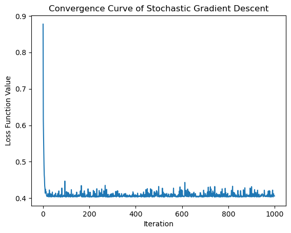
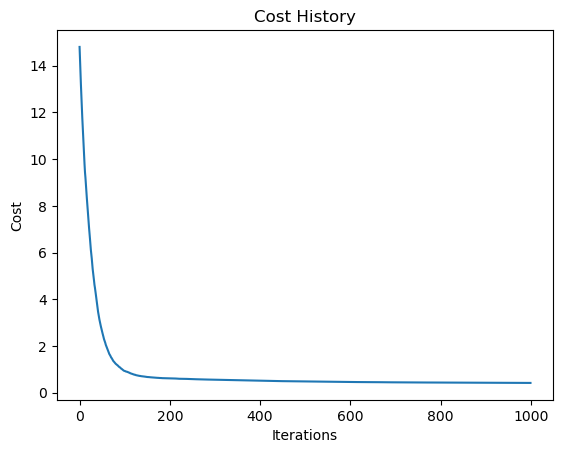

# 隨機梯度下降（Stochastic Gradient Descent，SGD）

SGD是一種優化算法，主要用於最小化損失函數，特別適用於大型數據集的訓練。相較於批量梯度下降，SGD每次僅使用一個樣本（或一小批樣本）進行模型參數的更新，使得算法更加快速且能夠有效處理大量數據。

## 基本步驟和特點

1. **隨機抽樣：** 在每次迭代中，從訓練數據中隨機抽樣一個樣本（或一小批樣本）。

2. **計算梯度：** 計算當前樣本（或樣本批次）的梯度，即損失函數對模型參數的偏導數。

3. **更新參數：** 使用計算得到的梯度來更新模型的參數。更新規則類似於批量梯度下降，但只基於當前樣本（或樣本批次）的信息。

4. **重複：** 重複以上步驟直到滿足停止條件，例如達到固定的迭代次數或損失函數收斂。

## 特點

- **更快的更新：** 每次僅使用一個樣本進行更新，因此計算速度更快，特別適用於大型數據集。

- **躲過局部極小值：** 隨機性使得SGD有可能躲過局部極小值，因為每次更新可能是在不同的方向上。

- **不穩定性：** 由於每次更新都是基於單一樣本，模型的參數可能會產生較大的波動，導致收斂的路徑可能不太平滑。

- **需要調整學習率：** 學習率需要仔細調整，因為單一樣本的梯度估計可能具有較大的方差。

SGD的一種變種是小批量梯度下降（Mini-batch Gradient Descent），它在每次更新中使用一小批樣本，介於批量梯度下降和SGD之間。這樣可以在一定程度上保留SGD的優勢，同時減少參數更新的方差。


# SGD（隨機梯度下降）的數學推演

SGD的數學推演與梯度下降類似，不同之處在於每次更新只使用一個樣本的梯度。以線性回歸的平方損失函數為例進行推演：

損失函數：

$$
F(\theta) = \frac{1}{2m} \sum_{i=1}^{m} (h_\theta(x^{(i)}) - y^{(i)})^2
$$

其中 $h_\theta(x^{(i)})$ 是模型的預測值， $y^{(i)}$ 是實際標籤值， $m$ 是樣本數。

## 推演過程

1. **隨機抽樣：** 每次迭代從訓練集中隨機抽樣一個樣本，記為 $(x^{(i)}, y^{(i)})$ 。

2. **計算梯度：** 計算當前樣本的梯度，即損失函數對模型參數 $\theta$ 的偏導數。

$$
\nabla F(\theta) = \frac{1}{m} (h_\theta(x^{(i)}) - y^{(i)}) \cdot x^{(i)}
$$

3. **更新參數：** 使用梯度下降的更新規則，將模型參數 $ \theta $ 更新：

$$
\theta = \theta - \alpha \nabla F(\theta)
$$

其中 $\alpha$ 是學習率。

4. **重複：** 重複以上步驟直到滿足停止條件，如達到固定的迭代次數或損失函數收斂。

這樣的更新過程使得模型的參數在每次迭代中都根據單一樣本進行微調，具有隨機性，有助於跳出局部極小值。然而，由於每次更新僅基於單一樣本，模型的參數可能會產生較大的波動，這是SGD的一個特點。

值得注意的是，SGD的更新規則中通常包含一個學習率 $\alpha$ ，這需要仔細調整，因為太大的學習率可能導致模型發散，而太小的學習率可能導致收斂速度過慢。


```python
import numpy as np
import matplotlib.pyplot as plt

# 生成虛擬數據
np.random.seed(42)
X = 2 * np.random.rand(100, 1)
y = 4 + 3 * X + np.random.randn(100, 1)

# 添加偏置項 x0 = 1
X_b = np.c_[np.ones((100, 1)), X]

# 定義損失函數
def compute_cost(X, y, theta):
    m = len(y)
    cost = np.sum((X.dot(theta) - y) ** 2) / (2 * m)
    return cost

# 定義隨機梯度下降算法
def stochastic_gradient_descent(X, y, theta, learning_rate, n_iterations):
    m = len(y)
    cost_history = []

    for iteration in range(n_iterations):
        for i in range(m):
            random_index = np.random.randint(m)
            xi = X[random_index:random_index+1]
            yi = y[random_index:random_index+1]
            gradients = xi.T.dot(xi.dot(theta) - yi)
            theta = theta - learning_rate * gradients

        # 計算當前參數下的損失函數值
        cost = compute_cost(X, y, theta)
        cost_history.append(cost)

    return theta, cost_history

# 初始化模型參數和學習率
theta_initial = np.random.randn(2, 1)
learning_rate = 0.01
n_iterations = 1000

# 使用隨機梯度下降訓練模型
theta, cost_history = stochastic_gradient_descent(X_b, y, theta_initial, learning_rate, n_iterations)

# 打印最終學習得到的模型參數
print("Final model parameters:", theta)

# Plot the convergence curve of the loss function
plt.plot(cost_history)
plt.xlabel('Iteration')
plt.ylabel('Loss Function Value')
plt.title('Convergence Curve of Stochastic Gradient Descent')
plt.show()

```

    Final model parameters: [[4.10928102]
     [2.80925713]]
    


    

    


# 小批量梯度下降（Mini-batch Gradient Descent）與隨機梯度下降（Stochastic Gradient Descent）的比較

## 1. 概念區別：

- **小批量梯度下降（Mini-batch Gradient Descent）：**
  - 使用一小批次（mini-batch）的訓練樣本來計算梯度和更新模型參數。
  - 小批量的大小是一個可以調整的超參數。

- **隨機梯度下降（Stochastic Gradient Descent）：**
  - 每次僅使用一個隨機選擇的訓練樣本來計算梯度和更新模型參數。

## 2. 梯度估計：

- **小批量梯度下降：**
  - 每次更新使用小批次樣本的平均梯度。
  - 小批次梯度的估計較單一樣本更穩定。

- **隨機梯度下降：**
  - 每次更新僅使用單一隨機選擇的樣本的梯度。
  - 梯度估計具有較大的隨機性。

## 3. 計算效率：

- **小批量梯度下降：**
  - 通常能夠充分利用硬體資源，並加速訓練過程。
  - 適用於中型和大型數據集。

- **隨機梯度下降：**
  - 計算速度快，但因為每次僅使用單一樣本，可能未充分利用硬體資源。
  - 適用於小型數據集，或在資源有限的情況下。

## 4. 選擇與調整：

- **小批量梯度下降：**
  - 是一種折衷方案，綜合了批量梯度下降和隨機梯度下降的優點。
  - 需要調整小批次的大小。

- **隨機梯度下降：**
  - 具有較大的隨機性，可能跳出局部極小值，但也可能導致不穩定的訓練。
  - 學習率的選擇更加關鍵。

總體而言，小批量梯度下降是一種較常使用的訓練算法，能夠在計算效率和模型穩定性之間找到一個平衡點。然而，在特定的應用場景中，隨機梯度下降的隨機性有時也能帶來額外的優勢。選擇適當的算法通常需要根據數據集的大小、計算資源和模型的特性進行調整。


```python
import numpy as np
import matplotlib.pyplot as plt

# 生成一個簡單的數據集
np.random.seed(42)
X = 2 * np.random.rand(100, 1)
y = 4 + 3 * X + np.random.randn(100, 1)

# 添加偏置項 x0 = 1
X_b = np.c_[np.ones((100, 1)), X]

# 定義損失函數
def compute_cost(X, y, theta):
    m = len(y)
    predictions = X.dot(theta)
    cost = (1 / (2 * m)) * np.sum((predictions - y) ** 2)
    return cost

# 定義小批量梯度下降算法
def mini_batch_gradient_descent(X, y, theta, learning_rate, n_iterations, batch_size):
    m = len(y)
    cost_history = []

    for iteration in range(n_iterations):
        # 隨機選擇一個小批量樣本
        batch_indices = np.random.choice(m, size=batch_size, replace=False)
        xi = X[batch_indices]
        yi = y[batch_indices]

        # 計算梯度並更新參數
        gradients = xi.T.dot(xi.dot(theta) - yi)
        theta = theta - (learning_rate / batch_size) * gradients

        # 計算當前參數下的損失函數值
        cost = compute_cost(X, y, theta)
        cost_history.append(cost)

    return theta, cost_history

# 初始化參數
theta_initial = np.random.randn(2, 1)

# 設定學習率和迭代次數
learning_rate = 0.01
n_iterations = 1000
batch_size = 10

# 使用小批量梯度下降進行訓練
theta_final, cost_history = mini_batch_gradient_descent(X_b, y, theta_initial, learning_rate, n_iterations, batch_size)

# 打印最終參數
print("Final Parameters:")
print(theta_final)

# 繪製損失函數值的變化
plt.plot(cost_history)
plt.xlabel('Iterations')
plt.ylabel('Cost')
plt.title('Cost History')
plt.show()

```

    Final Parameters:
    [[3.89050198]
     [3.06415121]]
    


    

    


```python

```
